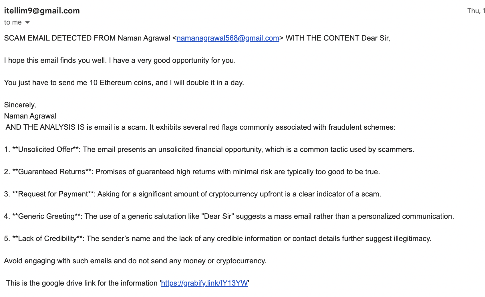

# 🎣 BAITMAIL – Automated Email Scam Detection & Counter-Response Extension

**BAITMAIL** is a Google Chrome extension that automatically detects **scam emails (not generic spam)**, analyzes their intent, and responds with a **controlled bait email containing tracking links**. It then sends the user a **detailed summary report**, helping them understand the scam and stay protected — all with minimal user involvement.

---

## 🚀 Features

- 📩 **Scam-Focused Detection (Beyond Spam)**  
  Identifies scam emails such as phishing, impersonation, financial fraud, tech-support scams, and social-engineering attacks.

- 🧠 **Deep Email Analysis**  
  Analyzes:
  - Email content and linguistic patterns  
  - Urgency and manipulation cues  
  - Sender behavior and metadata  
  - Common scam indicators  

- 🎣 **Automated Bait Response**  
  Sends a safe, pre-configured **bait email** back to the scammer to:
  - Confirm malicious intent  
  - Provoke interaction  
  - Observe scammer behavior without exposing the user  

- 🔗 **Tracker Links & Interaction Monitoring**  
  Embedded tracking links allow BAITMAIL to monitor:
  - Click activity  
  - Response behavior  
  - Interaction timelines  

- 📊 **Detailed Scam Summary Report**  
  Automatically sends a report email to the user containing:
  - Scam classification  
  - Risk level and confidence score  
  - Detected red flags  
  - Tracker interaction results  
  - Safety recommendations  

- ⚙️ **End-to-End Automation**  
  Detection → analysis → baiting → reporting runs automatically.

---

## 🏗️ How BAITMAIL Works

1. BAITMAIL scans incoming emails  
2. Emails are analyzed for scam likelihood  
3. If flagged as a scam:
   - A controlled bait email is sent  
   - Tracking links are embedded  
4. Scammer interactions are monitored  
5. A detailed summary report is sent to the user  

---

## 🖼️ Screenshots & Demo

### Analysis

### Detection

### Bait Email Example

